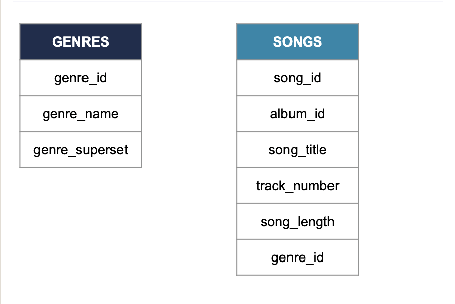

# Data Engineering for Everyone
---
## Storing data
### Data structures - Structures
In the video, you learned about the three different types of data structure. The less structured the data, the more flexibility there is in how it's stored.

Which of the following statements is **false**?

##### Possible Answers:
- [ ] Structured data is easier to search because values are separated and organized into columns.
- [ ] Semi-structured data allows some flexiblilty that structured data doesn't: different observations have different sizeds.
- [x] Structured data makes it harder to draw relationships with other data tables.
---

### Data structures - What's the difference
You've just learned that data can exist in different structures. Can you correctly define structured, semi-structured and unstructured data?

##### Answer:
###### Structured
* Is created and queried using SQL.
* Is easy to search and organize.
* Corresponds to data in tabular format.

###### Semi-structured
* Is moderately easy to search and organize.
* Follows a model while allowing more flexibility than structured data.
* Is stored in XML or JSON format, or in NoSQL databases.

###### Unstructured
* Stores images, pictures, videos and text.
* Is difficult to search and organize.
* Is usually stored in data lakes.
---

### SQL databases - We can work it out
Which language is the industry standard to create, update, maintain and query databases?

##### Possible Answers:
- [ ] English
- [ ] Python
- [x] SQL
- [ ] Javascript
---

### SQL databases - Columns
Which column allows these two tables to form a relational database?

###### Possible Answers:
- [ ] The Column of Marcus Aurelius
- [x] The `genre_id` column
- [ ] The `genre_name` column
- [ ] The `genre_superset` column
---

### SQL databases - Different breeds
SQL is the industry standard for Relational Database Management System. In other words, it is to databases what English is to pop music.

However, data engineers and data scientists don't use it the same way. Within the data science team at Spotflix, there are a few tasks that need to be assigned to either the data engineers or the data scientist. Can you help them do that?

##### Answer:
###### Data engineers
* Updating an artist's table after they edited their biography.
* Modifying the whole songs table to remove trailing spaces entered by mistake in front of the title.
* Creating a new table to store the songs customers listened to the most over the past year.

###### Data scientist
* Querying the artist table to find all the bands that come from France.
* Querying the top songs of the past year to identify which genre dominated.
* Querying the lyrics table to find all the songs that have 'data' in the title.
---

### Data warehouses and data lakes - Tell the truth
So far, you heard about data lakes, data warehouses, databases, and you just saw the differences between the three.

Which of the following statements is **true**?

##### Possible Answers:
- [ ] A data catalog is a document listing the prices of different data storage services.
- [x] A data warehouse is a type of database.
- [ ] A relational database usually stores unstructured data.
- [ ] The data lake stores well-organized, processed data that's easy to analyze.
---

### Data warehouses and data lakes - Our warehouse (in the middle of our street)
Although both are used for data storage, data lakes and data warehouses are used for different purposes and work in different ways.

You will find some statements on the right. Can you correctly classify them, depending on whether they apply to data lakes or data warehouses?

##### Answers:
###### A data lake
* Stores raw data.
* Is optimized for cost efficiency.
* Can store structured, semi-structured and unstructured data.
* Is mainly used by data scientists and engineers.

###### A data warehouse
* Is mainly used by data analysis, business analysts, data scientists and machine learning engineers.
* Stores mainly structured data.
* Is optimized for analysis.
* Usually stores smaller amounts of data than the other.
